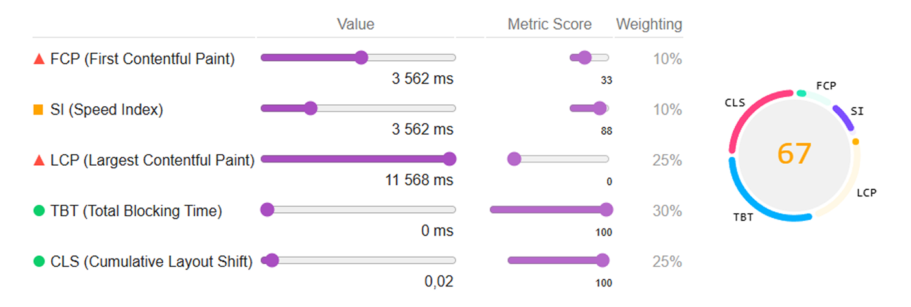
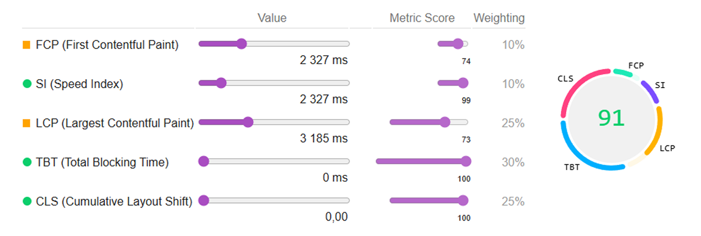
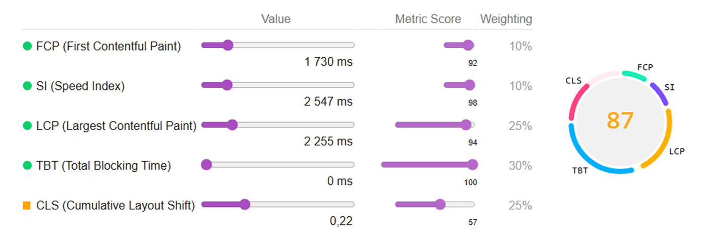
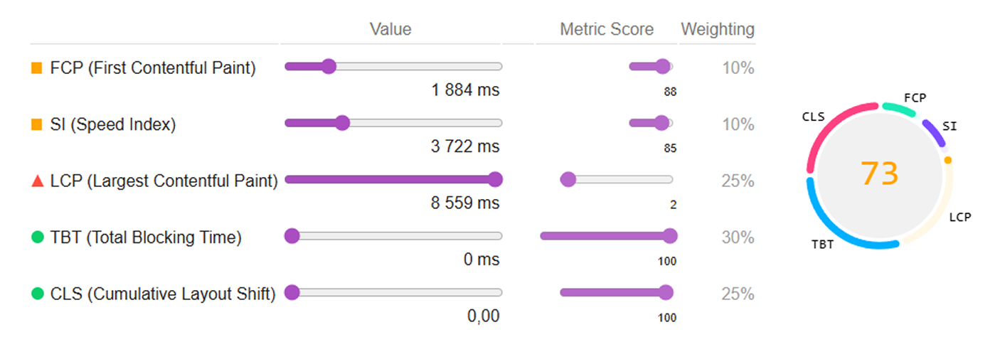
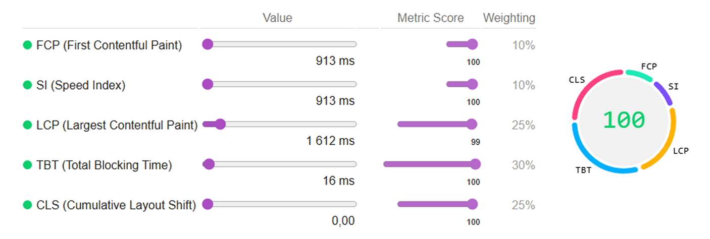

# VTS Limited — Corporate Website & Auth Pages

A modern, performance-focused corporate website with authentication pages, built with an emphasis on semantic HTML, accessibility (A11Y), SEO best practices, and Lighthouse optimization.

🔗 [**Live Demo**](https://vts.spekter.solutions)  

---

## Project Overview

This project represents the front-end implementation of the **VTS Limited** corporate website, including the main landing page and authentication flows (Sign In / Sign Up).  

The goal was to build a clean, scalable, and production-ready interface aligned with modern web standards.

---

## Scope of Work

- Corporate landing page (Index)
- Sign In page
- Sign Up page
- Semantic HTML5 structure
- Accessibility (A11Y) improvements
- SEO-friendly markup
- Performance optimization (Lighthouse)
- Custom UI components (forms, dropdowns, sliders)
- Animation-safe refactoring (without breaking visual effects)

---

## Tech Stack

- **HTML5** — semantic markup  
- **CSS3 / SCSS** — modular and scalable styles  
- **JavaScript (Vanilla)** — interactive behavior  
- **PHP** — templating and component includes  
- **WebP / SVG** — optimized image formats  

---

## Front-End Implementation Details

### Semantic Structure  

- Proper usage of `<header>`, `<main>`, `<section>`, `<nav>`, `<footer>`
- Clear heading hierarchy (H1 → H2 → H3)
- Logical document outline for SEO and screen readers

### Accessibility (A11Y)  

- Associated `<label>` elements for all form inputs
- Meaningful `alt` attributes for images
- Decorative icons hidden with `aria-hidden="true"`
- Keyboard-friendly interactive elements
- Focus-safe UI behavior

### SEO Optimization  

- Unique `<title>` and `<meta description>` per page
- SEO-friendly heading structure
- Crawlable internal links
- Robots and manifest configuration

---

## Project Structure

```  
public/
├── assets/
│   ├── css/
│   ├── scss/
│   ├── js/
│   └── img/
│
├── templates/
│   ├── components/
│   └── sections/
│
├── index.php
├── sign-in.php
├── sign-up.php
├── robots.txt
├── site.webmanifest
└── .htaccess
```

---

## Lighthouse Performance

The project was optimized based on Lighthouse audits for all key pages:
- Index
- Sign In
- Sign Up

Key optimizations include:
- Eliminating layout shifts (CLS)
- Optimized image delivery (WebP, explicit sizes)
- Deferred non-critical scripts
- Non-blocking font loading strategy
- Reduced render-blocking resources

---

## 📊 Lighthouse Metrics — Before → After Optimization Main Page

| Metric            | Before                                   | After                                    | Improvement |
|-------------------|-------------------------------------------|-------------------------------------------|-------------|
| **Performance**   |   |   | ↑ +9        |
| **Accessibility** |  |  | ↑ +16       |
| **Best Practices**|  |  | —          |
| **SEO**           |  |  | ↑ +34         |


### 🖼 Before / After 

|  |  |
|:--:|:--:|
| **Before** | **After** |

---

## 📊 Lighthouse Metrics — Before → After Optimization Sign In Page

| Metric            | Before                                   | After                                    | Improvement |
|-------------------|-------------------------------------------|-------------------------------------------|-------------|
| **Performance**   |   |   | ↑ +36       |
| **Accessibility** |  |  | ↑ +34        |
| **Best Practices**|  |  | —       |
| **SEO**           |  |  | ↑ +18           |


### 🖼 Before / After 

|  |  |
|:--:|:--:|
| **Before** | **After** |

---

## 📊 Lighthouse Metrics — Before → After Optimization Sign Up Page

| Metric            | Before                                   | After                                    | Improvement |
|-------------------|-------------------------------------------|-------------------------------------------|-------------|
| **Performance**   |   |   | ↑ +36       |
| **Accessibility** |  |  | ↑ +34        |
| **Best Practices**|  |  | —       |
| **SEO**           |  |  | ↑ +18           |


### 🖼 Before / After 

|  |  |
|:--:|:--:|
| **Before** | **After** |

---

### 🎯 JSON reports
- [Index Before JSON](./media/index-before.json)
- [Index After JSON](./media/index-after.json)
- [Sign In Before JSON](./media/sign-in-before.json)
- [Sign In After JSON](./media/sign-in-after.json)
- [Sign Up Before JSON](./media/sign-up-before.json)
- [Sign Up After JSON](./media/sign-up-after.json)

---


